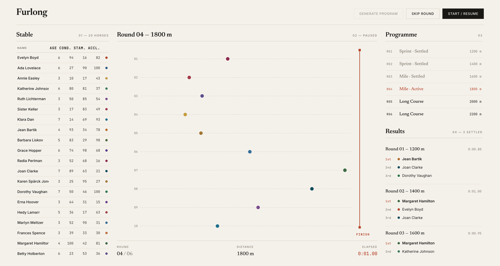

# Furlong — Horse Racing Simulation

An interactive horse racing game built for the Insider One Senior Frontend case study.

**Stack:** Vue 3 · Pinia · TypeScript · Vite · VueUse · Vitest · Playwright · Storybook · Chromatic

---

## Live

- 🎮 **App** — [furlong.akinoztorun.dev](https://furlong.akinoztorun.dev)
- 📚 **Storybook** — [furlong-ui.akinoztorun.dev](https://furlong-ui.akinoztorun.dev)
- 🎨 **Chromatic library** — [chromatic.com/library](https://www.chromatic.com/library?appId=69fd9ccf56c92159b892e713&branch=main)
- 📦 **Source** — this repository

---

[](https://github.com/akin-oz/furlong/actions/workflows/ci.yml)
[](https://github.com/akin-oz/furlong/actions/workflows/chromatic.yml)
[](https://codecov.io/gh/akin-oz/furlong)



> The championship leaderboard ranks all 20 horses by points across the 6-round series. It's not in this frame — try the [live demo](https://furlong.akinoztorun.dev) or scroll the right column. See [ADR 0011](./docs/adr/0011-overall-champion-determination.md) for the points formula.

## A 5-minute review

If you only have a few minutes, here is the recommended path through the codebase:

1. **Skim [`docs/adr/`](./docs/adr/)** — eleven decision records, each with context, decision, consequences, and alternatives. Start with [ADR 0001](./docs/adr/0001-feature-sliced-architecture.md) (architecture), [ADR 0003](./docs/adr/0003-race-engine-physiology-model.md) (engine), and [ADR 0010](./docs/adr/0010-test-strategy.md) (tests). The rest are scoped enough to read in under a minute each.
2. **Open the live app** and click `Generate program → Start race`. Six rounds run automatically; pause and skip controls work mid-race.
3. **Glance at [`src/features/race-track/model/raceEngine.ts`](./src/features/race-track/model/raceEngine.ts)** for the physiology model, then [`useRaceEngine.ts`](./src/features/race-track/model/useRaceEngine.ts) for the Vue wrapper that drives ticks via `useRafFn`.
4. **Run `npm run test:unit`** — 94 tests covering case rules, engine statistics, state machine, store, standings, and Storybook smoke. All green.
5. **Read the [Trade-offs](#trade-offs-and-what-id-do-next) section** below for what was deliberately left out and why.

---

## Quick start

```bash
npm install
npm run dev          # dev server
npm run build        # production build
npm run lint         # ESLint with FSD boundary checks
npm run typecheck    # vue-tsc strict
npm run test:unit    # Vitest (94 tests)
npm run test:e2e     # Playwright
npm run storybook    # Storybook locally
```

Requires Node 20+.

---

## Architecture

The codebase follows **Feature-Sliced Design** with the layer hierarchy enforced by `eslint-plugin-boundaries`:

```
src/
├── app/         → Root setup (Vue, Pinia, providers, global styles)
├── pages/       → Route-level composition (GamePage)
├── widgets/     → Layout-level composition (GameLayout)
├── features/    → User-facing capabilities
│   ├── horse-list/
│   ├── race-schedule/
│   ├── race-track/    ← engine lives in model/ (pure logic + Vue composable)
│   ├── results/
│   └── standings/
├── entities/    → Domain state (Pinia stores live here)
│   ├── horse/
│   └── race/
└── shared/      → Config, design tokens, utilities, base UI
```

**Layer rule:** upper layers may import from lower; cross-slice imports within the same layer are forbidden. Enforced by lint, not just convention.

This structure is **micro-frontend ready**: each feature has a public `index.ts`, the lint rule prevents internal coupling, and any slice could be remoted via Webpack Module Federation without architectural rework. (See ADR 0001 for the relationship to Insider's existing MFE migration.)

---

## Key decisions

All architectural decisions are recorded as ADRs in [`docs/adr/`](./docs/adr/):

| #    | Decision                                             |
|------|------------------------------------------------------|
| 0001 | Feature-Sliced Design with enforced boundaries       |
| 0002 | Pinia stores live in entities, not features          |
| 0003 | Race engine physiology (condition + stamina + accel) |
| 0004 | useRafFn + CSS transition for animation              |
| 0005 | No third-party animation library                     |
| 0006 | Config-driven tunables in `shared/config`            |
| 0007 | 6-state machine for race flow                        |
| 0008 | Skip Round (no Skip All); pause works in any state   |
| 0009 | Desktop-first, mobile reachable                      |
| 0010 | Two-tier test strategy (case rules + quality)        |
| 0011 | Overall champion via points-based standings          |
| 0012 | Copy centralization in `shared/config/copy.ts`       |

---

## Race engine — physiology model

Speed per tick is a weighted sum of three attributes, distance-weighted:

```
baseSpeed = condition × 0.5
          + acceleration × (1 − progress) × 0.3
          + stamina × progress × 0.2
```

Plus inertia smoothing, ±15% random noise, anaerobic-energy depletion (high-acceleration horses tire faster), and a final-stretch burst above 75% progress scaled by stamina.

Result: high-condition horses win statistically more often, but lower-condition horses can pull off occasional upsets — and a horse with low stamina can fade in the final stretch even if it leads early.

All tunables live in [`src/shared/config/racing.config.ts`](./src/shared/config/racing.config.ts).

---

## Design tokens

Visual direction was generated using claude.ai/design as a starting point, then refined into a self-contained token system in [`src/shared/config/tokens.ts`](./src/shared/config/tokens.ts).

The token structure follows **Insider Design System (IDS)** patterns:

- **Palette layer** — primitive scale, raw hex values
- **Tokens layer** — semantic intent (`text.primary`, `surface.raised`, etc.)

A future migration to actual IDS components would be a single mapping swap at the alias layer. The two-layer pattern was modeled after the publicly documented IDS foundations.

---

## Tests

Tests split into two intents:

**Case rule coverage** — explicit test names mirror the case brief, gated by CI:

```
✓ generates exactly 20 horses (rule 1)
✓ assigns a unique color to each horse (rule 2)
✓ keeps condition score between 1 and 100 (rule 3)
✓ produces exactly 6 rounds (rule 4)
✓ selects 10 horses per round from the available 20 (rule 5)
✓ uses distances 1200, 1400, 1600, 1800, 2000, 2200 in order (rule 6)
```

**Quality coverage** — engine statistics (over 100 simulations), state machine transitions, component behavior, full-race E2E, Storybook smoke tests, visual regression via Chromatic.

See [ADR 0010](./docs/adr/0010-test-strategy.md) for the full rationale.

---

## Trade-offs and what I'd do next

This is a 3-day case, so several deliberate scope decisions were made. None of them are oversights — each is documented in an ADR or noted here.

**Deliberately not included:**

- **Skip All button** — diminishing return over Skip Round; same code in a loop. ([ADR 0008](./docs/adr/0008-pause-resume-and-skip-semantics.md))
- **Third-party animation library** (GSAP, motion.dev) — CSS transition covers the requirement at zero dependency cost. ([ADR 0005](./docs/adr/0005-no-third-party-animation-library.md))
- **Backend / API layer** — the case is client-only; adding Express or Nuxt SSR would be overengineering. (Production architecture noted in [ADR 0001](./docs/adr/0001-feature-sliced-architecture.md).)
- **Mobile-first responsive** — desktop-first matches the case mockup; mobile remains reachable but not optimized. ([ADR 0009](./docs/adr/0009-responsive-and-viewport-strategy.md))
- **Direct IDS imitation** — without npm access to the production library, mimicking IDS visuals would risk a poor copy. The token *structure* mirrors IDS; *values* are independent.

**What I'd do with another week:**

- **Replay mode** — record per-tick state, scrub through finished races. The engine is already deterministic given a seed, so this is mostly a state-recording layer.
- **Configurable points formula** — surface the standings formula in the UI for "what-if" analysis.
- **Telemetry overlay** — speed/stamina/anaerobic energy curves per horse during a race, useful for understanding why a horse won or faded.
- **Internationalization** — `shared/config/locale` with i18n keys; current copy is English-only.
- **Reduced-motion mode** — respect `prefers-reduced-motion` for accessibility.
- **Real IDS migration** — once npm access is granted, swap the alias-layer mapping in `tokens.ts`. Components that match IDS primitives (Button Group, Status Tag) become drop-in.

---

## Open questions

Two domain questions were sent to the recruiter before implementation. Default assumptions are noted in the relevant ADRs:

1. **Round horse selection** — independent random per round (current default), or balanced distribution across 6 rounds?
2. **Generate Program re-click** — keep horses, regenerate schedule (current default), or regenerate horses too?

If the answers differ from defaults, the changes are localized to `buildSchedule.ts` and `GameLayout.vue` respectively.

---

## A note on the championship

The case brief is silent on whether to declare an overall winner across the 6-round series. Adding this felt like an obvious user expectation — "who won the day?" — so a points-based standings panel was added with a clearly documented formula. See [ADR 0011](./docs/adr/0011-overall-champion-determination.md) for the rationale and alternatives. If the case author intended individual rounds only, the panel is easy to remove.

## Production playbook

For a production deployment of this app, the observability stack would mirror
patterns I've shipped at scale on BCD:

- **Sentry**: Vue plugin with `tracesSampler` based on route, `SafeLinks` for
  PII filtering, session replay on errors only (quota management), release
  tracking via Vite source maps.
- **Datadog RUM**: Real user monitoring with custom marks for race start,
  round complete, and skip events. INP and LCP tracked per route.
- **Codecov**: Coverage gating on PRs.
- **Feature flags via GrowthBook**: Standings formula, animation strategy,
  and skip behavior would be flag-controlled for safe experimentation.

Implementing these here would be premature for a 3-day case scope — the demo
app has no users to observe. The architecture (FSD slices, config-driven
tunables, store boundaries) is intentionally observability-friendly.